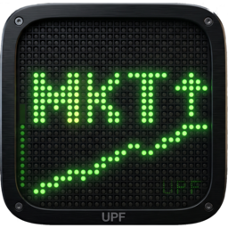

# Market Ticker



Banner de cotizaciones en tiempo real, estilo cinta de bolsa: fino (32 px), sin marco, ancho completo de pantalla, siempre a la vista. Multiplataforma (Linux, Windows, macOS).

 

## Características

- **Cinta desplazable** con cotizaciones de **19 mercados** (Europa, América, Asia-Pacífico — del S&P 500 al MERVAL argentino), actualizadas cada 15 minutos vía yfinance; con los mercados cerrados muestra los movimientos del último día hábil
- **Gráfico intradía + noticias por activo**: click en una cotización → evolución del precio de la última sesión (velas de 15 min) y titulares de las últimas **72 horas hábiles** — click en el titular y se abre en el navegador; los diálogos muestran el nombre completo de la compañía
- **Tickers personalizados**: buscador contra Yahoo Finance (símbolo o nombre) para sumar cualquier activo a la cinta con "+" — aunque no esté entre los 19 mercados — y quitarlo de a uno con "−"; la lista aparece como mercado propio ("Mis tickers") para verla sola o combinada
- **Menú ☰** junto al engranaje con todas las opciones (lo mismo que el click derecho)
- **Actualización automática**: chequeo diario contra los releases de GitHub; si hay versión nueva aparece un botón ⬆ (y queda siempre disponible en ⚙) que descarga e instala la actualización con el instalador nativo del SO
- **LED de estado**: verde = datos en vivo; rojo = sin conexión
- **Siempre visible**: reserva espacio de pantalla como una barra de tareas — las ventanas maximizadas se acomodan sin tapar el banner (Linux vía `_NET_WM_STRUT`, Windows vía API AppBar; macOS no lo permite)
- **3 idiomas** (🇪🇸 🇬🇧 🇩🇪) con banderas en la configuración
- **Filtros**: por mercado (multi-selección), por rango de precio y por variación diaria (escalas de subas ▲ y bajas ▼)
- Posición arriba o abajo, inicio automático con el sistema, base SQLite local con rotación diaria y gestión de backups
- Tickers numéricos asiáticos con nombre legible (7203.T → TOYOTA)

## Instalación

Descargá el instalador de tu sistema desde [Releases](../../releases):

- **Windows**: `market-ticker-X.Y.Z.msi` — doble click; instala per-user (sin permisos de administrador), crea "Market Ticker" en el menú inicio y al terminar lanza solo la preparación de dependencias y la app (necesita internet)
- **macOS**: `market-ticker-X.Y.Z.pkg` — instala "Market Ticker.app" en Aplicaciones y la abre al terminar; el primer arranque prepara las dependencias. Requiere macOS 11 (Big Sur) o superior; la app elige sola la versión de Qt compatible con tu sistema
- **Ubuntu/Debian**: `sudo dpkg -i market-ticker_X.Y.Z_all.deb` — queda en el menú de aplicaciones

El inicio automático con el sistema queda **activado por defecto** (se desactiva en ⚙). Las actualizaciones posteriores se ofrecen solas desde la app.

Único requisito: [Python 3.10+](https://www.python.org/downloads/) (en Windows, marcar "Add Python to PATH"). Los zips (`market-ticker-windows.zip` / `market-ticker-macos.zip` con `install.bat` / `install.sh`) siguen disponibles como alternativa manual.

### Ejecutar desde el código fuente (sin instaladores)

Solo hace falta Python 3.10+ y git; las dependencias se instalan con pip en un entorno virtual. La app son dos procesos: primero el backend (datos) y después el banner.

**Linux (Ubuntu/Debian)**

```bash
sudo apt install python3-venv libxcb-cursor0   # libxcb-cursor0: Qt bajo Wayland
git clone https://github.com/leabergero/market-ticker.git
cd market-ticker
python3 -m venv venv && source venv/bin/activate
pip install -r release/requirements.txt
python backend/app.py &      # backend en 127.0.0.1:5003
python frontend/main.py      # banner (ejecutar desde la raíz del repo)
```

**Windows (PowerShell o CMD)**

```bat
git clone https://github.com/leabergero/market-ticker.git
cd market-ticker
py -3 -m venv venv
venv\Scripts\activate
pip install -r release\requirements.txt
venv\Scripts\pythonw.exe backend\app.py
python frontend\main.py
```

**macOS**

```bash
git clone https://github.com/leabergero/market-ticker.git
cd market-ticker
python3 -m venv venv && source venv/bin/activate
pip install -r release/requirements.txt
# En macOS 12 (Monterey) agregar: pip install "PyQt6<6.9" "PyQt6-Qt6<6.9"
# En macOS 11 (Big Sur) agregar:  pip install "PyQt6<6.8" "PyQt6-Qt6<6.8"
python backend/app.py &
python frontend/main.py
```

Notas: el banner se ejecuta **desde la raíz del repo** (ahí busca `config/config.json`); la base SQLite y sus backups se crean solos en `backend/data/` (o en `TICKER_DATA_DIR` si se exporta). Para regenerar los instaladores nativos desde Linux están los scripts `installers/build_msi.sh`, `build_pkg.sh` y `build_deb.sh` (requisitos en el encabezado de cada uno).

## Arquitectura

```
backend/    Flask (127.0.0.1:5003) + APScheduler: scraping yfinance cada 15 min,
            SQLite con rotación diaria (23:59), API REST (tickers, history,
            news, backups)
frontend/   PyQt6: banner sin marco, cinta animada con hit-testing por
            cotización, gráfico intradía, i18n, auto-update, reserva de
            espacio por SO, autostart por SO
installers/ Builds nativos generados desde Linux: .msi (wixl), .pkg
            (mkbom + xar propio), .deb — la versión sale de APP_VERSION
            en frontend/main.py
release/    Instaladores y zips de distribución
```

En Wayland el banner fuerza X11 (XWayland) porque Wayland no permite posicionar ventanas ni reservar espacio; requiere `libxcb-cursor0`.

## API local

```
GET  /api/tickers?market=DAX,MERVAL&price_min=10&price_max=50
GET  /api/history?symbol=SAP.DE       # intradía 15 min de la última sesión
GET  /api/news?symbol=SAP.DE          # 72 h hábiles, en vivo con fallback a BD
GET  /api/health                      # incluye estado del último scrape (LED)
GET  /api/backups
POST /api/backups/delete-old          # {"days_keep": 7}
POST /api/backups/delete-all
```

## Autor

**Leandro R. Bergero** — MSc Finance & Banking (BSM-UPF)
[GitHub](https://github.com/leabergero) · [LinkedIn](https://www.linkedin.com/in/leandro-raul-bergero/)

## Licencia

MIT
